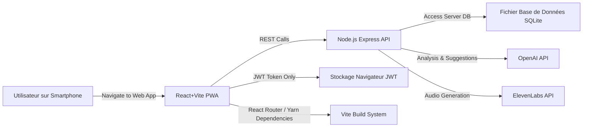

# Specification technique PoC

# Spécification technique – Micro Story (Proof of Concept)

## 1. Introduction

### 1.1 Objectif du document

Ce document vise à définir les spécifications techniques nécessaires au développement d’un Proof of Concept (PoC) de l’application “Micro Story” (MS). Par rapport à la version plus complète de la spécification, ce PoC met l’accent sur un ensemble de fonctionnalités limitées et prioritaires pour valider la faisabilité et l’intérêt de l’application.

Le PoC doit permettre :

- D’expérimenter l’architecture technique basée sur **React+Vite**, **Node.js** et **Yarn**.
- De développer une **Progressive Web App (PWA)** accessible localement.
- De valider le cycle de création de contenu (post), l’implémentation du Text-to-Speech (TTS) et l’analyse du texte pour la suggestion de hashtags.
- De proposer une démonstration simple mais fonctionnelle, autorisant des utilisateurs connectés sur le même réseau local Wi-Fi à accéder à l’application depuis leurs téléphones.

### 1.2 Portée du projet (PoC)

**Inclus** :

1. **Inscription et connexion**
2. **Fil d’actualité**
3. **Création de posts** (limité à de courts textes ou histoires longues avec TTS)
4. **Fonction TTS** (conversion audio basique, instructions TTS simples)
5. **Profil/Carnet personnel** (listing des posts de l’utilisateur)
6. **Analyse de texte** pour suggérer des hashtags et des instructions TTS
7. **Interactions** (Réactions via émojis, commentaires, partage simulé en local)
8. **Recherche** par hashtags et mots-clés

**Exclus** :

1. Système de modération
2. Écran de vote pour l’histoire de la semaine
3. Widgets de posts (poll, gauge, etc.)
4. Notifications
5. Communautés et algorithmes complexes d’abonnement/suivi
6. Fonctionnalités d’analytics avancées (Firebase, etc.)

### 1.3 Termes & Abréviations

- **MS** : Micro Story
- **PoC** : Proof of Concept
- **TTS** : Text-to-Speech
- **PWA** : Progressive Web App
- **API** : Application Programming Interface
- **OpenAI** : Fournisseur d’API IA pour TTS et analyse de texte
- **React** : Bibliothèque JavaScript pour la création d’interfaces
- **Node.js** : Environnement d’exécution JavaScript côté serveur
- **Vite** : Outil de build et de développement rapide pour le frontend
- **Yarn** : Gestionnaire de dépendances JavaScript
- **SQLite** : Système de gestion de base de données relationnelle légère (fichier unique) utilisée côté serveur.

---

## 2. Description générale

### 2.1 Contexte et opportunité

Le PoC de Micro Story s’inscrit dans la volonté de proposer un **réseau social anonyme** centré sur le partage d’histoires courtes et de récits plus longs (avec TTS). Pour tester rapidement l’idée, nous nous concentrons sur la configuration la plus légère possible : déploiement sur un ordinateur portable qui agit en serveur local (Node.js),
réseau Wi-Fi partagé, et PWA accessible depuis les navigateurs mobiles des testeurs.

Cette approche minimaliste permettra de valider l’acceptation utilisateur de l’idée, la facilité d’accès à la plateforme (grâce à la PWA) et la **pertinence des fonctionnalités essentielles** (création de contenu, TTS, hashtag, etc.).

### 2.2 Fonctionnalités principales (dans l’ordre des priorités du PoC)

Par ordre de priorité, les fonctionnalités incluses dans ce PoC sont :

1. **Inscription et connexion**
    - Simplifié au maximum avec une adresse e-mail, un mot de passe et une authentification en session storage pour ne pas avoir à gérer le logout
2. **Fil d’actualité**
    - Le fil d’actualité présente tous les posts publics des utilisateurs dans un ordre **chronologique inversé** (les plus récents en haut).
    - Il permet une **navigation fluide, immersive et intuitive**, avec un **scroll infini** et un affichage différencié pour les deux types de posts :
        - **Post A** : affiché sous forme de carte simple avec le contenu directement lisible.
        - **Post B** : carte enrichie avec titre, bouton de lecture TTS(visualisation de l’audio).
    - L’utilisateur peut cliquer sur chaque post pour l’ouvrir en **vue étendue** afin de lire ou écouter l’histoire dans son intégralité, commenter ou réagir plus librement.
3. **Création de posts** 
    - L'utilisateur commence par écrire une histoire via un champ texte simple (visibilité + contenu + date éventuelle). Une fois le contenu validé, le système détecte automatiquement si le post est de type A ou B (si le post contient moins de 60 mots, il est classé en Post A ; à partir de 60 mots inclus, il est considéré comme un Post B). En fonction du type, une deuxième page de création est affichée, avec des suggestions de titre, instructions TTS (post B uniquement), et hashtags préremplis, modifiables par l'utilisateur avant publication.
4. **Text-to-Speech**
    - Le TTS permet de transformer les posts de type B en contenu audio narré de manière naturelle.
        
        Lorsqu’un utilisateur termine la création d’un post long (Post B), une instruction TTS est automatiquement suggérée. Cette instruction (voix, ton, pauses, rythme) peut être modifiée avant publication. 
        
        Une fois le post publié, lorsqu’un utilisateur est le premier à vouloir écouter une histoire, les instructions son process par OpenAI LLM 4o pour créer des paramètres qui seront envoyé avec le texte de cette histoire à **l’API ElevenLabs**, qui génère le fichier audio.
        
        Les fichiers sont conservés sur le serveur local pour éviter une génération multiple et améliorer la vitesse de lecture ultérieure.
        
5. **Profil / Carnet personnel**
    - Permet de retrouver tout ses posts afin de se servir de l’application comme d’un carnet/journal personnel.
6. **Interactions**
    - Réactions (émoji parmis une sélection)
    - Commentaire (espace communautaire dédié au échanges lié à un post)
    - Partage (copie du lien dans le presse papier)
7. **Analyse de texte**
    - Suggère des hashtags et des instructions de tts en fonction du contenu de l’histoire pour rendre plus rapide la création de posts.
8. **Recherche** 
    - Par hashtags
    - Par mots clés

### 2.3 Utilisateurs cibles

- **Participants à la démonstration** : Tout utilisateur qui se connecte au réseau local pourra créer un compte et tester la plateforme.
- **Rôle démonstratif** : Il s’agit principalement de valider l’ergonomie et le fonctionnement technique devant un public restreint.

---

## 3. Architecture du PoC

### 3.1 Choix techniques

1. **Frontend** :
    - **React + Vite** pour une configuration de build et de dev rapide.
    - **Structure PWA** : L’application pourra être “installée” sur un téléphone via le navigateur.
    - Stockage côté client **uniquement pour le token d'authentification JWT** (via Session Storage).
2. **Backend** :
    - **Node.js** pour la logique serveur.
    - **Express** comme framework minimaliste.
    - **Yarn** comme gestionnaire de packages pour homogénéiser les dépendances entre front et back.
    - **Base de données locale SQLite** (gérée avec la librairie **better-sqlite3**) pour la persistance centralisée de toutes les données applicatives.
    - **Stockage persistant des fichiers audio** : répertoire dédié `/server-poc/audio/` pour conserver les fichiers audio TTS générés.
3. **OpenAI & ElevenLabs** :
    - Analyses des texte par OpenAI (LLM 4o) → Suggestion de hashtags et suggestion d’instructions tts.
    - Analyses des textes et instruction par OpenAI (LLM 4o) pour rajouter des pauses au sein des textes ainsi que paramètrer et choisir la voix pour l’API ElevenLabs.
    - **Génération de l’audio par ElevenLabs**, sur la base du texte enrichi et des instructions générées par OpenAI

### 3.2 Diagramme d’architecture



1. Ordinateur portable configuré en serveur (Node.js + application React + BDD locale pour toutes les données applicatives).
2. L’application React (buildée avec Vite) s’affiche.
3. Les requêtes API passent par Node.js/Express.
4. Les appels TTS/Analyse de texte passent par OpenAI.

### 3.3 Stratégie de déploiement local

1. **Ordinateur portable** configuré en serveur (Node.js + application React + **base de données SQLite**)..
2. **Connexion Wi-Fi partagée** : tous les téléphones rejoignent le même réseau.
3. **Adresse IP locale** : communiquée aux utilisateurs pour accéder à la PWA (ex. 192.168.0.10:3000).
4. **Démonstration en direct** : Les testeurs interagissent avec l’application, créent des comptes, publient des posts et testent la lecture TTS.

---

## 4. Spécifications fonctionnelles détaillées

### 4.1 Authentification et profil utilisateur

1. **Inscription** : email, mot de passe, pseudo.
2. **Connexion** : validation des identifiants, stockage d’un token en local.
3. **Création d’un profil** : pseudo, date d’inscription, etc.
4. **Accès profil** : l’utilisateur voit ses informations, peut modifier son pseudo et visualiser ses posts.
5. **Sécurité minimale** : hachage du mot de passe, vérification basique des inputs.

### 4.2 Fil d’actualité (trié uniquement par date)

1. **Structure du flux**
    - Affichage vertical (type scroll infini) avec chargement par lot (ex : 5 ou 10 posts).
    - **Tri** : du plus récent au plus ancien (`createdAt DESC`).
    - Requêtes backend paginées avec indicateurs de fin de contenu.
2. **Affichage différencié selon le type de post**
    
    **Post A (court)** :
    
    - Contenu textuel affiché en entier directement dans la card.
    - Composants visibles :
        - 3 Hashtags premiers hashtags
        - Date de publication
        - Contenu texte complet
        - Icônes d’interactions : réactions, commentaires, partage
    
    **Post B (long)** :
    
    - Mise en page plus immersive, avec accent sur l’aspect narratif.
    - Composants visibles :
        - 3 Hashtags premiers hashtags
        - Date de publication
        - Titre de l’histoire
        - Court extrait de l’histoire pour donner un avant goût
        - Bouton “Écouter l’histoire” (player audio miniaturisé)
        - Icônes d’interactions : réactions, commentaires, partage
3. **Interactions accessibles depuis le feed**
    - Cliquer sur une icône permet d’interagir directement :
        - Réagir avec un émoji
        - Ouvrir le champ de commentaire rapide (limité à 1 ligne)
        - Copier le lien pour partage local (toaster de confirmation)
    - Cliquer sur une card permet de l’afficher en vue étendu
    - Écouter le TTS depuis le feed
4. **Affichage étendu d’un post**
    
    À l’ouverture d’un post en vue étendu :
    
    **Post A** :
    
    Tout ce qu’il y a dans la vue card du post plus :
    
    - Affiche tous les **hashtags** associés au post.
    - Affiche le username
    - Affiche la **zone de commentaire complète** avec les commentaires existants en bas du contenu.
    
    **Post B** :
    
    Tout ce qu’il y a dans la vue card du post plus :
    
    - Affiche tous les **hashtags** associés.
    - Affiche le username
    - Affiche le **contenu texte complet** de l’histoire.
    - Affiche la **zone de commentaire complète** avec les commentaires existants en bas du contenu.
    
    **Navigation** :
    
    - Un bouton Retour permet de revenir facilement.
    - L'utilisateur peut glisser latéralement pour naviguer d’un post à un autre sans revenir en arrière.
5. **Accessibilité & Mobile-first**
    - Cartes responsives, optimisées pour lecture verticale sur smartphone.
    - Zone de clic bien dimensionnée sur les cartes.
    - Player audio compatible avec les interactions tactiles.
    - Texte contrasté, lisibilité adaptée aux petits écrans.

### 4.3 Création de post

1. **Écran 1 : Début de création de post**
    - **Visibilité** : public ou privé.
    - **Champ texte principal** : l’utilisateur rédige son histoire.
    - **Date optionnelle** : champ libre pour préciser quand a eu lieu l’histoire.
    - **Détection automatique du type de post** :
        - Si l’histoire contient **moins de 60 mots** → **Post A**.
        - Si l’histoire contient 60 **mots ou plus** → **Post B**.
    - CTA “Suivant” : lance le passage à l’étape 2.
2. **Écran 2 : Personnalisation du post**
    - Affiché uniquement après validation du contenu.
    - **Post A** :
        - Hashtags suggérés automatiquement.
    - **Post B** :
        - Titre suggéré (modifiable).
        - Instructions TTS proposées par IA (modifiables).
        - Hashtags proposés.
    - L'utilisateur peut tout modifier avant de publier.

### 4.4 Texte-to-Speech (TTS)

<aside>

**Fonctionnement de l’IA – étapes précises**

Le processus d’intelligence artificielle repose sur **trois étapes distinctes** :

1. **Création du post** : Lors de la rédaction d’un post B (6
2. 0 mots ou plus), une **suggestion de titre, de hashtags et d’instructions TTS** (ton, voix, rythme, ambiance) est proposée automatiquement via l’API d’OpenAI (LLM 4o). Ces suggestions sont modifiables avant publication.
3. **Première écoute du post** : Lorsqu’un utilisateur est **le premier à cliquer sur “Écouter l’histoire”**, les **instructions TTS** sont envoyées à OpenAI. Le LLM 4o :
    - Analyse les instructions,
    - Ajoute des **pauses réalistes** au texte (`<break time="x"/>`),
    - Transforme les consignes en **paramètres exploitables par ElevenLabs** (ex : `voiceId`, `stability`, `similarity`, `style_exaggeration`).
4. **Génération audio** : L’API d’ElevenLabs génère alors un **fichier audio MP3** à partir du **texte enrichi** et des **paramètres techniques**. Ce fichier est ensuite stocké localement pour éviter toute régénération.
</aside>

1. **Génération automatique et personnalisable des instructions TTS**
    - Lorsqu’un utilisateur rédige un post B (>60 mots), une fois le contenu validé, une **suggestion d’instruction TTS** est générée via OpenAI (LLM 4o), en fonction du style du texte. L’utilisateur peut la modifier avant publication. Ces instructions seront utilisées **plus tard**, uniquement lors de la première écoute du post.
2. **Enrichissement automatique du texte avec pauses**
    - L’IA insère automatiquement des pauses (`<break time="x"/>`) dans le texte pour rendre la lecture plus fluide et naturelle (notamment en se basant sur les instructions de TTS).
    - Exemples :
        - Après un point ou une virgule.
        - Avant un changement de ton ou d’émotion.
        - À des moments clés pour marquer l’attention ou créer du suspense.
        - À des moments précis détaillé dans les instructions de TTS
3. **Génération et stockage du fichier audio**
    - Lorsqu’un utilisateur est le premier à cliquer sur “Écouter l’histoire”, les **instructions TTS sont d’abord analysées via OpenAI (LLM 4o)**. Cette étape produit :
        - Un texte enrichi avec des **pauses réalistes**,
        - Un ensemble de **paramètres chiffrés** pour ElevenLabs (`voiceId`, `stability`, `similarity`, `style_exaggeration`).
    - Ces éléments sont ensuite envoyés à ElevenLabs pour générer le fichier audio. Le fichier est stocké localement dans le dossier `/server-poc/audio/`.
    - Le système vérifie si un fichier existe déjà (pour éviter les doublons).
4. **Lecture du post audio**
    - Les commandes de lectures sont disponible à coté d’une visualisation de l’audio :
        - Dans le **feed**
        - Dans la **fiche du post**
        - Sur le **profil utilisateur**
    - Si le fichier est déjà généré → lecture immédiate en streaming.
    - Sinon → chargement via l’API, puis streaming dès que prêt.
5. **Expérience utilisateur**
    - Icône de chargement pendant la génération.
    - Affichage dynamique : “Génération audio en cours…”
    - Lecture contrôlée avec un player HTML5 (lecture, pause, reprise).
    - Si erreur → fallback vers la version texte.

### 4.5 Interactions avec les posts

1. **Émojis** : un ensemble restreint (ex. 3-5 émojis) pour réagir, stocké dans le modèle Reaction.
2. **Commentaires** : gérés par le modèle Comment séparé, limités à 250 caractères.
3. **Partages** : gérés par le modèle Interaction de type "share", copie le lien du post dans le presse papier.
4. **Affichage des statistiques** : le décompte des réactions et commentaires est calculé via des requêtes séparées ou actualisé dans le champ stats du Post après chaque opération.
5. Un utilisateur ne peut ajouter qu’une **réaction par emoji par post**. Le système empêche les doublons.

### 4.6 Profil personnel / Carnet perso

1. **Vue Profil** : liste des posts créés par l’utilisateur.
2. **Possibilité de modification** : l’utilisateur peut éditer ou supprimer ses propres posts.
3. **Infos** : pseudo, date d’inscription, stats de publication (nombre de posts, etc.).

### 4.7 Analyse de texte (suggestion de hashtags & instructions TTS)

1. **Appel à l’API OpenAI** avec un extrait du post.
2. **Réponse** : propositions de hashtags et un style d’intonation TTS.
3. **L’utilisateur** peut accepter ou ignorer ces suggestions.

### 4.8 Recherche basique (par hashtags ou par mots-clés)

1. **Champ de recherche** : l’utilisateur saisit un mot-clé ou un hashtag.
2. **Filtrage** : l’API renvoie les posts qui contiennent le mot-clé ou le hashtag.
3. **Affichage des résultats** : toujours paginés, triés par date.

---

## 5. Spécifications techniques détaillées

### 5.1 Architecture Front-End (React+Vite)

1. **Structure des dossiers** (exemple) :
    
    ```
    src/
      ├── assets/            # Images, icônes, etc.
      ├── components/        # Composants React réutilisables
      │   ├── atoms/         # petit composants
      │   ├── molecules/     # Composants utilisant atomes
      │   ├── organisms/     # Composants utilisant atomes et molécules
      ├── hooks/             # Hooks personnalisés
      ├── pages/             # Pages principales
      │   ├── Home/          # Page d'accueil (feed)
      │   ├── Auth/          # Pages de connexion/inscription
      │   ├── Create/        # Création de post
      │   ├── Profile/       # Profil utilisateur
      │   └── Search/        # Recherche
      ├── features/          # Modules Redux (slices)
      │   ├── auth/          # Authentification
      │   ├── posts/         # Gestion des posts
      │   ├── comments/      # Gestion des commentaires
      │   ├── reactions/     # Gestion des réactions
      │   ├── interactions/  # Gestion des interactions (partages)
      │   └── search/        # Fonctionnalité de recherche
      ├── services/          # Services API
      │   ├── api.js         # Configuration Axios
      │   ├── posts.js       # Service pour les posts
      │   ├── auth.js        # Service d'authentification
      │   ├── comments.js    # Service pour les commentaires
      │   ├── reactions.js   # Service pour les réactions
      │   ├── interactions.js # Service pour les interactions
      │   └── tts.js         # Service Text-to-Speech
      ├── utils/             # Fonctions utilitaires
      ├── App.jsx            # Composant racine
      ├── main.jsx           # Point d'entrée
      └── service-worker.js  # Service worker pour PWA
    ```
    
2. **Approche PWA** :
    - Fichier `manifest.json` pour les métadonnées (icônes, nom d’app, etc.).
    - Service Worker géré automatiquement par Vite ou via plugin.
3. **Flux de données** :
    - **React** pour la logique d’affichage.
    - **State global** minimal (optionnel : Redux ou simple ContextAPI si les données sont légères).
4. **Gestion d'état temporaire** :
    - Persistance côté client **uniquement pour le token JWT** d'authentification (ex: dans Session Storage).
    - Toutes les autres données applicatives (posts, profils, commentaires) sont récupérées dynamiquement du back-end via l'API et ne sont **pas** stockées durablement côté client.
5. **Intégration TTS** :
    - Appel d’une route `/api/tts` sur le back-end.
    - Lecture audio côté client (HTML5 audio player).

### 5.2 Architecture Back-End (Node.js + Express)

1. **Structure des dossiers** (exemple) :
    
    ```
    server-poc/
      ├── config/           # Configuration du serveur
      │   ├── database.js   # Configuration Server
      │   └── openai.js     # Configuration OpenAI API
      ├── controllers/      # Contrôleurs
      │   ├── auth.js       # Authentification
      │   ├── posts.js      # Gestion des posts
      │   ├── comments.js   # AJOUT: Gestion des commentaires
      │   ├── reactions.js  # AJOUT: Gestion des réactions
      │   ├── interactions.js # AJOUT: Gestion des interactions (partages)
      │   └── tts.js        # Service TTS
      ├── models/           # Modèles de données
      │   ├── User.js       # Schéma utilisateur
      │   ├── Post.js       # Schéma post (sans commentaires ni réactions)
      │   ├── Comment.js    # Schéma commentaire
      │   ├── Reaction.js   # AJOUT: Schéma réaction
      │   └── Interaction.js # AJOUT: Schéma interaction
      ├── routes/           # Routes API
      │   ├── auth.js       # Routes authentification
      │   ├── posts.js      # Routes posts
      │   ├── comments.js   # AJOUT: Routes commentaires
      │   ├── reactions.js  # AJOUT: Routes réactions
      │   ├── interactions.js # AJOUT: Routes interactions
      │   └── tts.js        # Routes TTS
      ├── middleware/       # Middleware
      │   ├── auth.js       # Vérification d'authentification
      │   └── errorHandler.js # Gestion des erreurs
      ├── utils/            # Fonctions utilitaires
      │   ├── textAnalysis.js # Analyse de texte
      │   └── validators.js   # Validateurs de données
      ├── audio/            # Stockage pour les audio générés via l'IA
      ├── database.sqlite   # Base de données SQLite
      └── server.js         # Point d'entrée du serveur
    ```
    
    `models/` seront implémentés en utilisant la librairie `better-sqlite3` pour exécuter des requêtes SQL directes, garantissant simplicité, rapidité et efficacité, adaptées au contexte léger d'un PoC.
    
2. **Local Database** :
    - **Base de données SQLite** :
        - Utilisation d'un fichier unique (`database.sqlite`) géré exclusivement avec la librairie `better-sqlite3`, choisie pour sa simplicité d'installation, d'utilisation et ses performances idéales pour un PoC local.
        - Assure la centralisation et la persistance des données pour tous les utilisateurs connectés.
3. **Sécurité** :
    - Hachage des mots de passe (bcrypt).
    - Vérification du token JWT dans les routes protégées.

### 5.3 Intégration API OpenAI & ElevenLabs (TTS et analyse de texte)

1. **Clé d’API** stockée en variable d’environnement pour OpenAI et ElevenLabs.
2. **Processus d'intégration** :
    - **Analyse des instructions TTS par l'API OpenAI (LLM 4o) :**
    L’IA joue un rôle pivot dans la génération vocale : elle ne se contente pas de proposer des instructions, mais interprète et transforme celles-ci en paramètres techniques conformes à l’API ElevenLabs :
        - `voiceId` : identifiant de la voix à utiliser
        - `stability` : stabilité de la voix (0 à 100)
        - `similarity_boost` : niveau de fidélité à la voix (0 à 100)
        - `style_exaggeration` : exagération du style vocal (0  à 100)
    - Le LLM enrichit également le texte avec des **balises de pause** pour améliorer la prosodie lors de la lecture. (ex : "Hold on, let me think." <break time="1.5s" /> "Alright, I’ve got it.")
    - ElevenLabs génère le fichier audio selon les paramètres reçus avec le texte contenant les pauses.
    - Stockage persistant du fichier audio généré sur le serveur, dans le dossier `/server-poc/audio/`.
    - Mise à disposition du fichier audio via streaming HTTP à travers un endpoint dédié (`/api/audio/{audioId}`).
3. **Routes** :
    - `/api/tts/generate` : reçoit texte et instructions, effectue l'analyse via LLM 4o et appelle ElevenLabs pour la génération et le stockage du fichier audio.
    - `/api/audio/{audioId}` : streaming HTTP du fichier audio stocké sur le serveur vers le client.
    - `/api/analyze` : suggestions via LLM 4o d'OpenAI pour hashtags et instructions TTS.
4. **Gestion d’erreurs** :
    - Timeout, latence trop élevée.
    - Erreur d’authentification si les clés sont incorrectes.
5. **Limitations** :
    - Nombre d’appels par minute limité pour éviter de saturer le quota des services OpenAI et ElevenLabs.
    - OpenAI fournit uniquement les paramètres (voix, ton, pauses) et un texte enrichi. L'audio est ensuite généré à partir de ces éléments par ElevenLabs.

### 5.4 Modèles de données complets

Ci-dessous, la description des principaux modèles de données pour ce PoC. Nous utilisons une notation JSON à titre d’exemple ; en pratique, vous pouvez adapter ces schémas à votre ORM ou votre base locale.

Ces modèles décrivent la structure logique des données qui seront stockées dans la base **SQLite** côté serveur. La mise en œuvre utilisera des tables SQL correspondantes.

### 5.4.1 Modèle Utilisateur (User)

```json
{
  "_id": "string/number",         // Identifiant unique (généré)
  "email": "string",              // Email unique pour l'utilisateur
  "passwordHash": "string",       // Mot de passe haché
  "pseudo": "string",             // Pseudonyme d'affichage
  "createdAt": "ISODateString",   // Date de création du compte
  "postAmount": "int"             // Nombre de posts de l'utilisateur
}
```

- `email` doit être unique.
- `passwordHash` haché via bcrypt (ou équivalent).
- `pseudo` peut être soumis à contrainte d’unicité (facultatif).

### 5.4.2 Modèle Post (Post)

```json
{
  "_id": "string/number",
  "authorId": "string/number",           // Référence à User._id
  "type": "Post A | Post B",             // "Post A" ou "Post B"
  "title": "string",                     // Optionnel pour un post court
  "content": "string",                   // Contenu textuel
  "hashtags": ["string"],                // Tableau de hashtags
  "ttsInstructions": "string",           // Instructions pour le TTS
  "ttsAudioUrl": "/api/audio/{audioId}"  // URL vers le fichier audio généré
  "ttsGenerated": "Boolean",             // true si l'audio a été généré
  "createdAt": "ISODateString",
  "updatedAt": "ISODateString",
  "visibility": "string",                // "public" ou "private"
}
```

- `reactions` et `comments` peuvent être dans des collections séparées si nécessaire.
- Le champ `ttsAudioUrl` pointe vers l'endpoint serveur dédié pour la diffusion en streaming HTTP du fichier audio TTS.

### 5.4.3 Modèle Commentaire

```json
{
  "_id": "string/number",
  "postId": "string/number",      // Référence vers Post._id
  "userId": "string/number",      // Référence vers User._id
  "content": "string",
  "createdAt": "ISODateString",
  "updatedAt": "ISODateString"
}
```

### 5.4.4 Modèle Réaction

```json
{
  "_id": "string/number",
  "postId": "string/number",      // Référence vers Post._id
  "userId": "string/number",      // Référence vers User._id
  "emoji": "string",              // e.g. "❤️"
  "createdAt": "ISODateString"
}
```

### 5.4.5 Modèle Partage

```json
{
  "_id": "string/number",
  "postId": "string/number",      // Référence vers Post._id
  "userId": "string/number",      // Référence vers User._id
  "type": "string",               // e.g. "share"
  "createdAt": "ISODateString"
}
```

### 5.5 Liste complète des endpoints

Voici la liste plus détaillée des endpoints REST, pour couvrir l’ensemble des besoins du PoC :

### 5.5.1 Authentification (Auth)

1. **Inscription**
    - **POST** `/api/auth/register`
    - **Body** :
        
        ```json
        {
          "email": "string",
          "password": "string",
          "pseudo": "string"
        }
        ```
        
    - **Réponse** : renvoie le nouvel utilisateur + un token JWT.
2. **Connexion**
    - **POST** `/api/auth/login`
    - **Body** :
        
        ```json
        {
          "email": "string",
          "password": "string"
        }
        ```
        
    - **Réponse** : renvoie l’objet user + un token JWT.

### 5.5.2 Utilisateurs (Users)

1. **Informations du profil courant**
    - **GET** `/api/users/me`
    - **Header** : Bearer token (JWT)
    - **Réponse** : infos de l’utilisateur (email, pseudo, dates, etc.)
2. **Modifier son profil** (facultatif)
    - **PUT** `/api/users/me`
    - **Body** :
        
        ```json
        {
          "pseudo": "string",
          "email": "string" // si on autorise la modif
        }
        ```
        
    - **Réponse** : nouvel objet user mis à jour.
3. **Lister ses posts**
    - **GET** `/api/users/me/posts`
    - Récupère tous les posts dont `authorId == userId`.

### 5.5.3 Posts

1. **Récupérer la liste de posts** (fil d’actualité)
    - **GET** `/api/posts`
    - **Query** : `?page=1` ou `?limit=10` pour la pagination
    - **Réponse** : tableau de posts triés par date (DESC).
2. **Créer un nouveau post**
    - **POST** `/api/posts`
    - **Body** :
        
        ```json
        {
          "type": "Post A | Post B",
          "title": "string",
          "content": "string",
          "hashtags": ["string"],
          "visibility": "public | private"
        }
        ```
        
    - **Réponse** : l’objet post créé.
3. **Obtenir un post spécifique**
    - **GET** `/api/posts/:id`
    - **Paramètre** : `id` = identifiant du post
    - **Réponse** : objet post.
4. **Supprimer un post**
    - **DELETE** `/api/posts/:id`
    - **Réponse** : statut de réussite.

### 5.5.4 Commentaires

1. **Récupérer les commentaires** d’un posts
    - **GET** `/api/comments?postId={id}`
    - **Query** : postId (obligatoire)
    - **Réponse** : Tableau de commentaires associés à ce post
2. **Créer un nouveau commentaire**
    - **POST** `/api/comments` - Crée un nouveau commentaire
    - **Body** :
        
        ```json
        {
          "postId": "string/number",
          "content": "string"
        }
        ```
        
    - **Réponse** : L’objet commentaire créé.
3. **Supprimer un commentaire**
    - **DELETE** `/api/comments/:id`
    - **Réponse** : statut de réussite.

### 5.5.5 Réactions

1. **Récupérer les réactions d’un post**
    - **GET** `/api/reactions?postId={id}`
    - **Query** : postId (obligatoire)
    - **Réponse** : tableau des réactions associées à ce post
2. **Ajouter une réaction**
    - **POST** `/api/reactions`
    - **Body** :
    
    ```json
    {
      "postId": "string/number",
      "emoji": "string"
    }
    ```
    
    - **Réponse** : L’objet réaction créé
3. **Supprimer une réaction**
    - **DELETE** `/api/reactions/:id`
    - **Réponse** : Statut de réussite.

### 5.5.6 Interaction diverses

1. **Créer une nouvelle interaction**
    - **POST** `/api/interactions`
    
    ```json
    {
      "postId": "string/number",
      "type": "share"
    }
    ```
    
    - **Réponse** : L’objet interaction créé
2. **Récupérer la liste des intéraction** pour un post
    - **GET** `/api/interactions`

### 5.5.7 Recherche

1. **Recherche basique**
    - **GET** `/api/search?query=xxx`
    - **Réponse** : liste de posts qui contiennent le mot `xxx` dans `content` ou dans `hashtags`.

### 5.5.8 Text-to-Speech (TTS)

1. **Générer un audio TTS**
    - **POST** `/api/tts/generate`
    - **Reçoit** :
        
        ```json
        {
          "text": "string",
          "instructions": "string"
        }
        ```
        
    - **Traitement :**
        
        Lors de l’appel, OpenAI LLM 4o :
        
        - Enrichit le texte avec des **balises de pauses** (`<break time="x.xs" />`),
        - **Analyse les instructions TTS** pour en extraire les paramètres techniques adaptés à ElevenLabs :
            - `voiceId`
            - `stability`
            - `similarity_boost`
            - `style_exaggeration`
        
        Ces éléments sont ensuite transmis à ElevenLabs pour générer un fichier audio.
        
    - **Réponse** :
    
    ```json
    {
      "audioUrl": "/api/audio/xxx",
      "success": true
    }
    ```
    
2. **Streaming audio TTS**
    - **GET** `/api/audio/{audioId}`
        - Streaming HTTP du fichier local (audio/mpeg).
    - **Réponse** : Flux audio HTTP (`audio/mpeg` ou format similaire), adapté à une lecture immédiate par un lecteur HTML5 côté client.

### 5.5.9 Analyse de texte (OpenAI)

1. **Suggestion de hashtags**
    - **POST** `/api/text/hashtags-suggestions`
    - **Body** :
        
        ```json
        {
          "text": "string"
        }
        ```
        
    - **Réponse** :
        
        ```json
        {
          "suggestedHashtags": ["string"]
        }
        ```
        
2. **Suggestion d’instructions TTS**
    - **POST** `/api/text/tts-suggestions`
    - **Body** :
        
        ```json
        {
          "text": "string"
        }
        ```
        
    - **Réponse** :
        
        ```json
        {
          "ttsInstructions": "string"
        }
        ```
        

---

## 6. Sécurité et gestion des erreurs

### 6.1 Sécurité

Même si le projet Micro Story en est au stade de PoC et ne nécessite pas une sécurité avancée, quelques bonnes pratiques minimales sont mises en œuvre pour garantir une sécurité basique :

- **Authentification :** Utilisation d’un JWT (JSON Web Token) généré après l’inscription et la connexion. Le token est vérifié côté serveur pour protéger l'accès aux endpoints sensibles.
- **Hachage des mots de passe :** Les mots de passe utilisateurs sont systématiquement hachés (bcrypt) avant d’être enregistrés dans la base de données locale.
- **Protection des clés d’API :** Les clés API OpenAI et ElevenLabs sont stockées exclusivement dans des variables d’environnement (`.env`), jamais exposées côté client ni dans le repository GitHub.
- **Validation des inputs utilisateurs :** Validation basique côté serveur pour empêcher des injections ou des entrées invalides (longueur maximale, caractères spéciaux, etc.).
- Le token JWT a une durée de validité de **24h**. Aucun mécanisme de refresh token n’est prévu dans le cadre du PoC.

### 6.2 Gestion des erreurs

Pour assurer une expérience utilisateur fluide durant la démonstration, une gestion simplifiée des erreurs est prévue :

- **Timeouts des APIs externes (OpenAI & ElevenLabs) :**
    - En cas d’échec ou timeout (latence élevée), un message clair est retourné côté client indiquant à l’utilisateur de réessayer ultérieurement.
    - Mise en place d’un délai raisonnable (10-15s max.) pour éviter les blocages prolongés.
- **Erreurs de génération audio (TTS) :**
    - Si la génération audio échoue (par exemple erreur de quota ou réseau), le système propose une option de fallback en affichant uniquement la version texte du post.
- **Erreurs réseau et serveur :**
    - En cas d’indisponibilité temporaire du serveur local ou de perte de connexion, l’application indique clairement à l’utilisateur le problème via une alerte ou un toast d'erreur.
- **Gestion des erreurs client (React) :**
    - Implémentation de try/catch basiques sur les requêtes API afin d’afficher clairement les messages d’erreur côté client (ex : « Impossible de charger les posts », « Vérifiez votre connexion », etc.).

Ces mesures simples sont adaptées au contexte de démonstration et assurent une gestion efficace des erreurs pour offrir une expérience utilisateur fluide durant le PoC.

---

## 7. Déploiement pour la démonstration

1. **Repository GitHub** : [https://github.com/alexisbaud/microstory](https://github.com/alexisbaud/microstory)
    - Deux dossiers possibles : `frontend/` (React+Vite) et `backend/` (Node.js).
2. **Installation** :
    - Cloner le repo.
    - `yarn install` dans chaque dossier.
    - Assurez-vous d'avoir installé la dépendance `better-sqlite3` côté backend (`yarn add better-sqlite3`).
    - Configurer la clé OpenAI dans un fichier `.env`.
3. **Exécution** :
    - Lancer le back-end : `yarn start` (écoute sur un port, ex. 3001).
    - Lancer le front-end : `yarn dev` (port 3000).
    - Construire la PWA : `yarn build` (puis servir les fichiers statiques).
4. **Accès** :
    - Obtenir l’adresse IP locale de la machine.
    - Sur les smartphones, entrer `http://192.168.xx.xx:3000`.
    - Installer la PWA via le navigateur.

---

## 8. Tests & validations

1. **Tests unitaires** :
    - Niveau front : vérifier la logique des composants critiques (ex. création de post).
    - Niveau back : vérifier les endpoints (auth, création post, etc.).
2. **Tests d’intégration** :
    - Parcours utilisateur : inscription -> création post -> lecture TTS -> interactions.
    - Check si la pagination et le scroll infini fonctionnent.
3. **Recette en conditions réelles** :
    - Plusieurs téléphones connectés au même Wi-Fi.
    - Vérification de l’accessibilité simultanée.
    - Validation du fonctionnement du processus complet TTS (analyse par LLM 4o, génération audio par ElevenLabs, stockage persistant et streaming HTTP vers le client) en conditions réelles.
4. **Retour d’expérience** :
    - Collecte du feedback des testeurs sur l’ergonomie.
    - Évaluation de la performance (latence, fluidité du scroll).

---

### Conclusion

Ce PoC permettra de vérifier la pertinence de Micro Story à travers un environnement simplifié et local. Les choix techniques (React+Vite, Node.js, Yarn, base de données SQLite locale) visent une grande simplicité de déploiement et de maintenance. Les fonctionnalités retenues (TTS, analyse de texte, interactions) fourniront un aperçu satisfaisant du potentiel de la plateforme, tout en conservant une implémentation technique légère.